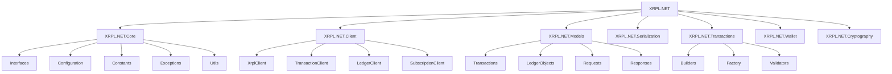

# XRPL.NET

<div align="center">
  


[](https://opensource.org/licenses/MIT)
[](https://dotnet.microsoft.com/en-us/)
[](https://xrpl.org/)

**A comprehensive .NET library for interacting with the XRP Ledger**

</div>

## 📋 Overview

XRPL.NET is a powerful and flexible .NET library designed to simplify interaction with the XRP Ledger. It provides a clean, strongly-typed interface for building, signing, and submitting transactions, as well as querying ledger data and managing wallets.

## ✨ Features

| Feature | Status | Description |
|---------|--------|-------------|
| **Transaction Models** | ✅ Complete | Comprehensive models for all transaction types |
| **Transaction Builders** | ✅ Complete | Fluent API for building transactions |
| **Transaction Submission** | ⚠️ Ongoing | Basic submission functionality implemented |
| **Binary Serialization** | ✅⚠️ Almost Complete | De/Serialization implemented, Dev needed |
| **Client Configuration** | ✅ Complete | Flexible configuration options for different networks |
| **Error Handling** | ✅ Complete | Robust exception handling and Result pattern |
| **Wallet Management** | ⚠️ Ongoing | Key generation, derivation implemented, Dev needed |
| **HTTP/WebSocket Clients** | ⚠️ Ongoing | Communication with XRPL nodes |
| **Request/Response Models** | ❌ Planned | Models for XRPL API requests and responses |
| **Ledger Objects** | ❌ Planned | Models for ledger objects (accounts, offers, etc.) |
| **Cryptography** | ⚠️ Ongoing | Cryptographic operations for the XRP Ledger |
| **NFT Support** | ❌ Planned | Models for NFT operations implemented and that's it |
| **Smart Contracts** | ⚠️ Partial | Basic support for Hooks |
| **Cross-Chain Bridge** | ❌ Planned | Models for cross-chain operations |
| **AMM Support** | ❌ Planned | Models for Automated Market Maker operations |

## 🚀 Installation

```bash
dotnet add nothing-it's-not-yet-sufficiently-good-to-be-added-on-nuget
```

## 🔧 Usage

### Initializing the Client

```csharp
using var loggerFactory = LoggerFactory.Create(builder =>
{
    builder.AddConsole()
        .SetMinimumLevel(LogLevel.Information);
});
var logger = loggerFactory.CreateLogger<Program>();

// Create a client connected to DevNet
var clientOptions = new XrplClientOptions()
    .UseNetwork(NetworkType.DevNet);
    
var client = new XrplClient(options, loggerFactory);

// Connect to the network
await client.ConnectAsync();
logger.LogInformation("Connected to {0}", client.CurrentServerUri);

// Get server info
var serverInfo = await client.GetServerInfoAsync();
logger.LogInformation("Server version: {0}", serverInfo.BuildVersion);
logger.LogInformation("Ledger range: {0}", serverInfo.CompleteLedgers);
logger.LogInformation("Validated ledger: {0}", serverInfo.ValidatedLedgerIndex);
```

### Generate a Wallet
```csharp
// Create a wallet
logger.LogInformation("Creating a new wallet...");
var wallet = XrplWallet.Generate();
logger.LogInformation("Generated wallet address: {0}", wallet.Address);
logger.LogInformation("Secret: {0}", wallet.GetSecret());
logger.LogInformation("Public key: {0}", wallet.PublicKey);
```


### [...]

## 🏗️ Architecture

XRPL.NET is designed with a modular architecture to provide flexibility and maintainability:



## 📊 Development Status

XRPL.NET is currently in active development. The core transaction models and builders are complete, but many other components are still in progress or planned for future releases.

### Roadmap

1. **Current Phase**: Core transaction models, builders, and serialization
2. **Next Phase**: Wallet implementation, HTTP/WebSocket clients
3. **Future Phase**: Complete ledger object models, advanced features

## 🤝 Contributing

Contributions are welcome! Please feel free to submit a Pull Request.

1. Fork the repository
2. Create your feature branch (`git checkout -b feature/amazing-feature`)
3. Commit your changes (`git commit -m 'Add some amazing feature'`)
4. Push to the branch (`git push origin feature/amazing-feature`)
5. Open a Pull Request

## 📜 License

This project is licensed under the MIT License - see the LICENSE file for details.

## 🔗 Resources

- [XRP Ledger Developer Portal](https://xrpl.org/docs.html)
- [XRP Ledger Dev Tools](https://xrpl.org/dev-tools.html)
- [Ripple Developer Blog](https://developers.ripple.com/)

---

<div align="center">
  
**Built with ❤️ for the XRP Ledger community**

</div>